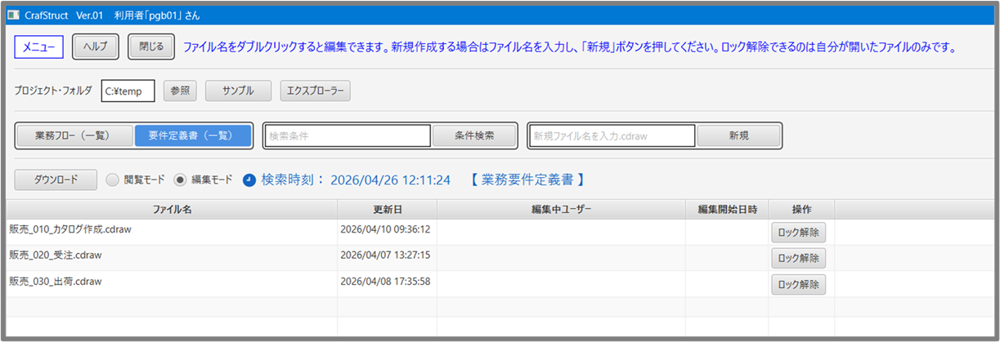
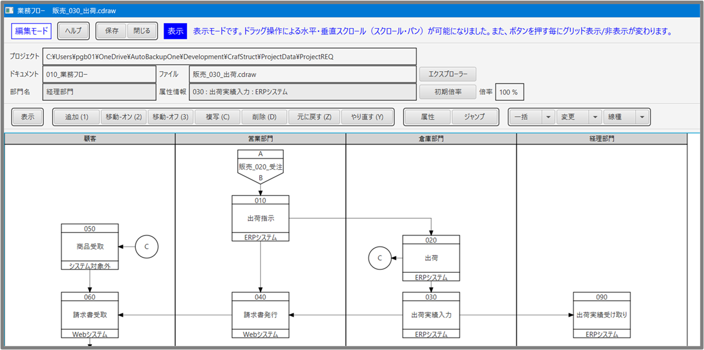
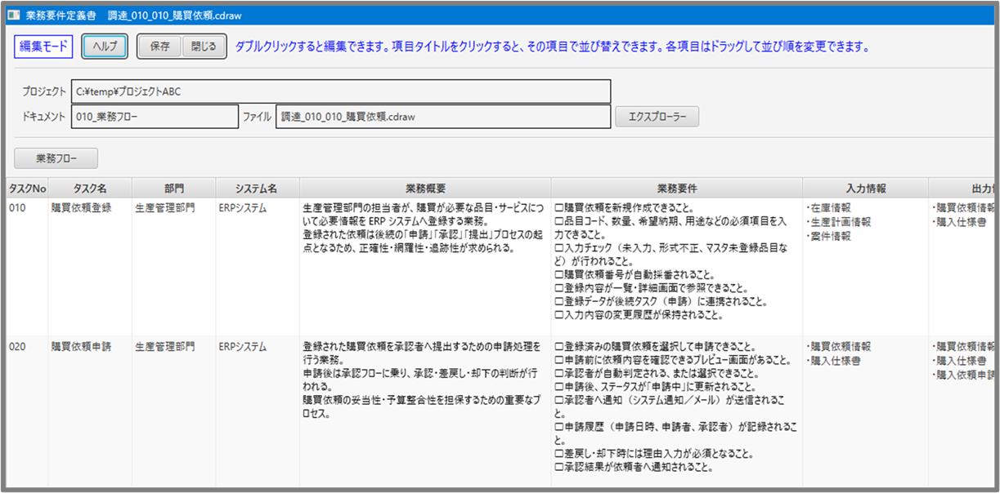

# 業務フロー & 業務要件定義書 作成ツール — CrafStruct

**CrafStruct** は、**業務フロー**と**業務要件定義書**を統合的に作成できる Windows デスクトップツールです。  
業務フローで作成した内容をもとに業務要件定義書が自動生成され、両者の編集内容は相互に反映されます。  

ZIP を解凍し、同梱の **CrafStruct.exe** を実行するだけで利用できます。

## ✨ 特徴
CrafStruct は、業務フローと業務要件定義書を **一つのプロジェクトとして統合管理** できる点が最大の特徴です。
これにより、二重管理や整合性チェックの手間を大幅に減らせます。

- **業務フローと業務要件定義書の項目を共通化**  
フローで作成した内容をもとに要件項目、ソリューション項目が自動整理され、二重管理を防ぎます。

- **業務フロー作成に必要なシンボル図形を標準搭載**  
業務フロー作成に必要な図形を標準搭載しています。実務で使う最小限の9種類に絞っています。

- **データストア図形を必須にしない設計**  
必要に応じて利用できますが、タスク図形にはシステム名・入力情報・出力情報といった属性が備わっているため、通常の業務フロー作成ではタスク図形だけで十分に対応できます。

- **結合子の動作**  
結合子（自）をクリックすると相手先が強調され、結合子（他）をクリックすると対応する別フローへ移動できます。

- **スイムレーン単位での図形移動に対応**  
部門追加・変更時のレイアウト調整が容易です。

- **グリッド吸収機能**  
図形を移動した際に位置が一定間隔のグリッドへ自動的に揃うため、レイアウトが乱れにくく、業務フロー全体の見通しが向上します。細かな位置調整の手間を減らし、短時間で整ったフロー図を作成できます。

- **接続点スナップのオン／オフ切り替え**  
図形と線分の連動を用途に応じて切り替えられます。

- **グリッド・接続点・シーケンスフロー矢印の表示切り替え**  
編集時にはグリッドや接続点、シーケンスフロー矢印を表示して作図しやすくし、閲覧時にはそれらを非表示にして図面をすっきり確認できます。用途に応じて表示／非表示を切り替えられます。

- **閲覧モード/編集モード**  
閲覧モードと編集モードがあり、ドキュメントを確認したいだけの場合は閲覧モードで開くことで、誤って編集されることを防げます。

- **排他制御に対応**  
サーバー上のドキュメントを複数人で編集する際、上書き衝突を防ぎます。

- **業務要件定義書を Excel 形式で出力**  
業務フローから自動生成された要件定義書を Excel（.xlsx）としてダウンロードできます。
複数の業務要件定義書を 1 つの Excel ファイルにまとめて出力することも可能です。

- **レジストリ不使用**  
ZIP 形式で配布しており、展開することで実行できます。そのため、レジストリ未使用で安心して利用できます。

## 🖥️ 画面構成

### メニュー画面（CrafMenu）

アプリの入口画面では、「業務フロー」と「業務要件定義書」のファイル一覧を表示し、そこから各編集画面（CrafDraw / CrafBfc）へ移動できます。
また、一覧に表示された業務要件定義書は、ファイル単位で Excel 形式としてダウンロードできます。

### 業務フロー（CrafDraw）

業務フローを作成・編集する画面です。あらかじめ用意された図形を使って、担当部署や処理の流れを整理できます。

### 業務要件定義書（CrafBfc）

業務フローの内容をもとに要件項目を確認・編集する画面です。
業務フローと項目が連動しており、整合性を保ちながら編集できます。

## 📥 ダウンロード
下記の GitHub Releases から ZIP（CrafStruct.zip）をダウンロードして下さい。

https://github.com/takeo-2026/CrafStruct/releases/latest

## 📁 ファイル構成
配布 ZIP に含まれるファイルとフォルダの一覧です。

- **app/**  
  アプリが動作するために必要な部品（外部ライブラリ）が入っています。
  通常、このフォルダを操作する必要はありません。

- **runtime**  
  アプリを動かすための Java 実行環境です。
  このフォルダが同梱されているため、ユーザーが Java をインストールする必要はありません。

- **SampleProject/**  
  初回起動時に読み込まれるサンプルプロジェクトです。
  画面上部の「サンプル」ボタンからいつでも開くことができます。

- **CrafStruct.exe（実行ファイル）**  
  アプリ本体です。

- **readme.txt**  
  README.md のテキスト版です。  

## 📦 セットアップ（導入手順）

ダウンロードした ZIP を任意の場所(デスクトップなど)で展開してください。

## 📘 使い方（基本操作）
- **起動方法**  
**CrafStruct.exe**を実行してください。

- **起動時の案内**  
初回起動時はサンプルプロジェクトが自動設定され、サンプルの業務フローと業務要件定義書を開いて操作を確認できます。画面に表示される案内メッセージに従って操作を進めてください。2回目以降は、前回使用したプロジェクトフォルダが自動的に選択されます。

- **ヘルプの表示**  
各画面左上の「ヘルプ」から、その画面専用の HTML マニュアルを開くことができます。

- **サンプルプロジェクト**  
「サンプル」ボタンから、いつでもサンプルデータを開けます。初回起動時に自動設定された内容と同じものです。サンプル内のファイルは保存操作が無効化されており、自由に編集しても元のデータが変更されることはありません。

- **保存**  
編集内容は右上の「保存」ボタンで保存できます。  
※サンプルプロジェクトのドキュメントは保存できません。

- **閉じる**  
左上の「閉じる」ボタン、またはウィンドウ右上の 「×」 をクリックして画面を閉じます。

## 🛡️ SmartScreen の警告について
初回起動時に Microsoft Defender SmartScreen が「Windows によって PC が保護されました」と表示される場合があります。

これは **署名のない新しいアプリを一時的に止める Windows の通常動作** です。

実行する場合は  
**「詳細情報」 → 「実行」** を選択してください。

## 📄 ライセンス
CrafStruct License (Custom)

本アプリケーションは、営利目的での再配布・販売を除き、無償で利用できます。  
社内業務やお客様向け資料作成など、商用サービスとして提供しない範囲であれば自由に利用できます。  
営利目的での利用を希望される場合は、作者の許可が必要です。  
ソースコードは公開していません。

## ⚠️ 免責事項
本アプリケーションは個人開発として提供しており、動作や結果を保証するものではありません。
利用に伴うトラブルや損害について、作者は一切の責任を負いません。

## 🤝 貢献
Issue や Pull Request は歓迎します。  
改善提案や不具合報告もお気軽にお寄せください。  
個人開発のため、いただいたご報告に対して即時の対応や修正をお約束するものではありません。  
寄せられた内容は今後の改善の参考にさせていただきます。

## 👤 作者
CrafStruct は個人開発として制作しています。

作者：Takeo Saito  
ご質問・ご連絡は Issues からお願いします。  
質問や相談は Discussions へお願いします。
