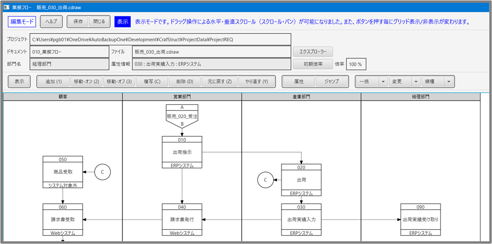
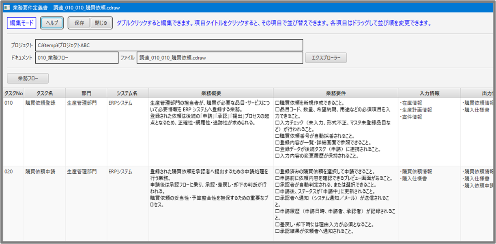

# 🚀 CrafStruct — 業務フローと要件定義書を“完全同期”で作成できる新しい標準ツール

**CrafStruct は、業務フローと業務要件定義書を一体で扱える唯一のデスクトップアプリです。**  
フローで描いた内容がそのまま要件定義書に反映され、粒度・整合性・項目体系が自動で揃います。

Visio / Draw.io / BizAgi では絶対に実現できない  
**「業務フローと要件定義書の完全同期」**  
これが CrafStruct の最大の価値です。

ZIP を展開して **CrafStruct.exe** を実行するだけで利用できます（インストール不要）。

## ✨ なぜ CrafStruct が必要なのか

要件定義フェーズでは、  
- 業務フロー（As-Is / To-Be）  
- 業務要件定義書（要件一覧）  

という複数資料を行き来しながら作業します。

しかし現場では次の問題が常に発生します：

- フローと要件定義書の整合性が取れない  
- 粒度がバラつく  
- 複数資料を行き来して作業効率が低下する  
- Excel の要件定義書が属人化しやすい  

**CrafStruct はこの問題を根本から解決します。**

## 🌟 主要特徴

### **1. 業務フローと要件定義書を完全同期**
タスク属性（入力情報・出力情報・ロール・システム名・業務要件など）は  
**フローと要件定義書の両方で共有され、どちらで編集しても即時反映。**

整合性チェックが不要になります。

### **2. 粒度が自然に揃う「タスク属性体系」**
業務タスクをハンドオフ基準で分割し、  
要件定義書の粒度が自動で統一されます。

属人化しやすい要件定義書の品質が安定します。

### **3. Excel 要件定義書をワンクリックで自動生成**
複数フローをマージして  
**1つの Excel にまとめて出力可能。**

Fit/Gap、設計、テストまでそのまま使えます。

### **4. 図形配置のストレスがゼロ**
- スイムレーン単位の移動  
- グリッド吸収でレイアウトが崩れない  
- 接続点スナップの ON/OFF  
- 必要最小限の9種類の図形だけを搭載  

「描くことに集中できる」UI です。

### **5. インストール不要・レジストリ未使用**
ZIP を展開して実行するだけ。  
社内 PC でも安心して利用できます。

## 🖥️ 画面イメージ

### **業務フロー（CrafDraw）**
担当部署・処理の流れを整理しながら、  
タスク属性を設定すると要件定義書に即時反映されます。

### **業務要件定義書（CrafBfc）**
業務フローと完全連動した要件項目を編集できます。  
粒度・整合性が自動で揃うため、資料間の整合性チェックが不要です。

## 📥 ダウンロード

最新バージョンはこちら：

👉 [https://github.com/takeo-2026/CrafStruct/releases/latest](https://github.com/takeo-2026/CrafStruct/releases/latest)
https://github.com/takeo-2026/CrafStruct/releases/latest

ZIP を展開し、**CrafStruct.exe** を実行するだけで利用できます。

## 📦 ファイル構成

- **CrafStruct.exe** — アプリ本体  
- **runtime/** — 同梱 Java 実行環境（Java インストール不要）  
- **SampleProject/** — 初回起動時に読み込まれるサンプル  
- **app/** — 必要な外部ライブラリ  

## 🛡️ SmartScreen について
初回起動時に SmartScreen が表示される場合があります。  
**「詳細情報 → 実行」** を選択してください（署名なしアプリの通常動作です）。

## 📄 ライセンス
- 社内利用・非営利利用：自由  
- 再配布・販売：禁止  
- 商用利用：要相談  
- ソースコードは非公開  

## ⚠️ 免責事項
本アプリケーションは個人開発として提供されており、動作や結果を保証するものではありません。  
利用に伴うトラブル・損害について、作者は一切の責任を負いません。

## 🤝 貢献
Issue / Pull Request / 改善提案は歓迎します。  
個人開発のため即時対応はできませんが、すべて目を通しています。

## 📘 関連記事
CrafStruct の設計思想はこちらにまとめています：

Qiita
[https://qiita.com/pgb01471/items/cceb8f4f293873c7e2cd](https://qiita.com/pgb01471/items/cceb8f4f293873c7e2cd)

## 👤 作者
Takeo Saito  
